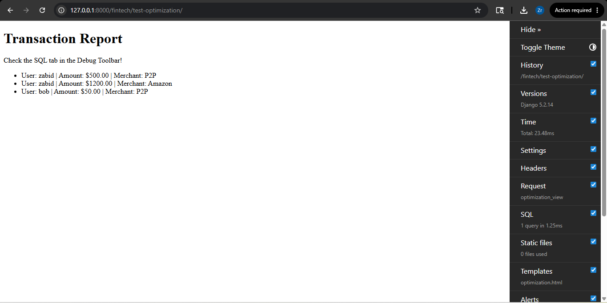

# Optimization Report: Fintech Payment System

## 1. Identified Issue: N+1 Queries
When listing transactions, the application was performing separate database lookups for the Sender's Account, the User's Profile, and the Merchant details for every single transaction row.

- **Unoptimized Performance:** 8 queries for 3 transactions.
- **Complexity:** O(N) queries relative to the number of transactions.

## 2. Implemented Solution: select_related
By utilizing Django's `select_related()` method, I performed a SQL JOIN at the database level to fetch all related foreign key data in a single hit.

- **Optimized Query:** `Transaction.objects.select_related('sender__user', 'merchant').all()`
- **Optimized Performance:** 1 query for any number of transactions.
- **Complexity:** O(1) database hits.

## 3. Visual Evidence
- **Before Optimization:** 8 Queries executed.

*Result: 8 queries executed*

- **After Optimization:** 1 Query executed.

*Result: 1 query executed*